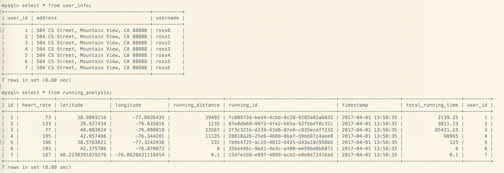

# running-information-service

Back end of a microservice, supporting CRUD of running information analysis.

### Timeline

> Dec 18 -- init the proj. REST API 0.3

> Dec 19 -- updated the REST API (v0.7); http-request results no longer use pagination.

> Dec 20 -- added UserInfo entity @OneToOne mappped with RunningInformation. Updated REST API(v0.9). Tested MySQL connection.

### REST API:

- Create running information using JSON input
- Search running information by username
- Search running information by runningId
- Return all running information and ordered by healthWarningLevel from HIGH to
LOW. This API needs to support pagination, each page returns two running
information.
- Delete running information by runningId

### To launch the application:  

* For mac/win user, start `docker-quickstart terminal`
  * For mac users, run `docker-machine restart default` then `eval $(docker-machine env default)`
* cd to `/running-information-service`. Run `docker-compose up` to start the docker container for mysql.
* in the same directory run `mvn clean install` to compile the maven project;
* cd to subdirectory `/target` and run `java -jar *.jar` to start a tomcat server (port 8080) accessible through http request.

## Testing

### Sample testing (via postman):

- Create running information using JSON input
  * post `http://localhost:8080/runningInformation` with Json data as request body
- Search running information by username
  * get `http://localhost:8080/runningInformation/users/?username=ross0`
- Search running information by runningId
  * get `http://localhost:8080/runningInformation/runningId/?runningId=35be446c-9ed1-4e3c-a400-ee59bd0b6872`
- Return all running information and ordered by healthWarningLevel from HIGH to
LOW. This API needs to support pagination, each page returns two running
information.
  * get `http://localhost:8080/runningInformation/OrderByHWL/?page=0`
- Delete running information by runningId
  * delete `http://localhost:8080/deleteBy/?runningId=fb0b4725-ac25-4812-b425-d43a18c958bb`

### Sample testing result
MySQL tables after posting data through HTTP request:

